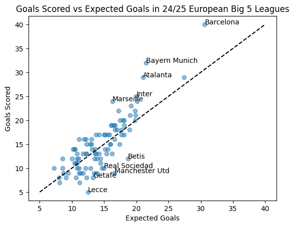

# Findings

Based on the above scatterplot, we can see that Barcelona, Bayern, Atalanta, Inter and Marseille are the biggest overperforming teams, in contrast, we can see that Betis, Sociedad, Manchester United, Getafe and Lecce are the biggest underperforming teams so far in the 2024/24 season across the top 5 leagues.
